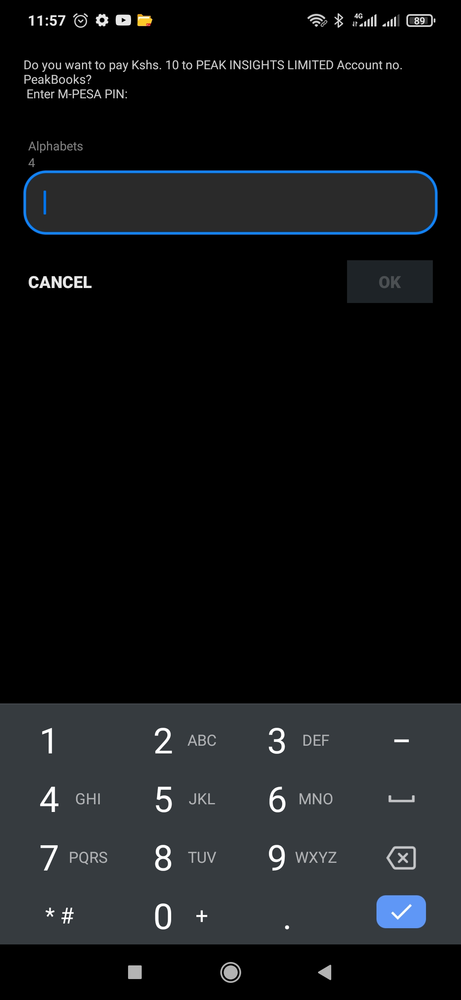

## DARAJA-2-MPESA-APIs-Denoland
>Fully written in Typescript with Denoland Oak Server. Can be helpfully to those who would like to do Safaricom API inegration in smooth and easy way.

**Save time!!**

## Generate Access Token
-----
```TypeScript
  /**
	   * @description mpesa access token
	   */
	createToken: async ({ request, response }: { request: any, response: any }) => {
		try {
			// get a base64 encoded string
			const buf = btoa(`${MPESA.b2c_consumer_api}:${MPESA.b2c_secret}`);
			// authentication string
			// deno-lint-ignore prefer-const
			let auth = `Basic ${buf}`;
			// send a GET request to the URL
			const postRequest = await fetch(`${MPESA.url_token}`, {
				method: 'GET',
				headers: {
					Authorization: `${auth}`,
					Accept: '*/*',
				},
			});
			if (postRequest) {
				const data = await postRequest.json();
				console.log(data.access_token);
				/**
				* @description HERE IS YOUR ACCESS TOKEN!!!!
				*/
				response.status = 200;
				response.body = {
					status: true,
					access_token: data.access_token,
				};
			}
			// get the access token from server response
		} catch (error) {
			response.status = 400;
			response.body = {
				status: false,
				message: `${error}`,
			};
		}
	},
```
### Expected Response

``` JSON
{
    "status": true,
    "access_token": "biYaKfTjrAAv8XXcHnMMGNARUCX0"
}
```
# Lipa Na Mpesa (STK Push)

You need access token before you proceed with **STK Push**. See the above on how to generate one.

**See the below sample of stk implementation**

```TypeScript
      /**
	   * @description stk push transaction
	   */
	stkController: async ({ request, response }: { request: any, response: any }) => {
		try {
			const body = await request.body();
			const values = await body.value; // get values from post request. 

			let timestamp = moment(new Date()).format('YYYYMMDDHHmmss'); // timestamp generate

			console.log(timestamp) // log out the timestamp

			let passkey = ""; // passkey from mpesa

			let shortcode;
			// get a base64 encoded string
			const lipa_na_mpesa_password = btoa(`${shortcode}${passkey}${timestamp}`); //base64 encoded string

			console.log(lipa_na_mpesa_password)

			// post request to skt push api
			const postSTKPush = await fetch(`https://api.safaricom.co.ke/mpesa/stkpush/v1/processrequest`, {
				method: 'POST',
				headers: {
					'Content-Type': 'application/json',
					Authorization: `Bearer `, // token to be passed here
				},
				// body params to be passed
				body: JSON.stringify({
					BusinessShortCode: '', // shortcode
					Password: `${lipa_na_mpesa_password}`, //password generated
					Timestamp: `${timestamp}`, // timestampth
					TransactionType: 'CustomerPayBillOnline',
					Amount: `${values.amount}`, // amount
					Passkey: `${passkey}`, // passkey given from safarciom
					PartyA: '',
					PartyB: '', // shortcode
					PhoneNumber: `${values.msisdn}`, // phone number for initiation
					CallBackURL: '', //response to be sent
					AccountReference: '', // account reference anything
					TransactionDesc: '' // transaction Desc
				}),
			});
			if (postSTKPush) {
				// handle response type
				const data_response = await postSTKPush.json();
				console.log(postSTKPush);
				//output response
				response.body = {
					status: true,
					status_code: 200,
					data: data_response,
					message: 'Success!',
				};
			}
			// get the access token from server response
		} catch (error) {
			response.status = 400;
			response.body = {
				status: false,
				message: `${error}`,
			};
		}
	},
```

### Response after a successfuly stk initiation

```JSON
{
    "status": true,
    "status_code": 200,
    "data": {
        "MerchantRequestID": "11155-2654663-1",
        "CheckoutRequestID": "ws_CO_07102021115704986051",
        "ResponseCode": "0",
        "ResponseDescription": "Success. Request accepted for processing",
        "CustomerMessage": "Success. Request accepted for processing"
    },
    "message": "Success!"
}
```



### Response from Safaricom
```JSON
{
   "Body":{
      "stkCallback":{
         "MerchantRequestID":"61318-2679023-2",
         "CheckoutRequestID":"ws_CO_07102021122016639763",
         "ResultCode":0,
         "ResultDesc":"The service request is processed successfully.",
         "CallbackMetadata":{
            "Item":[
               {
                  "Name":"Amount",
                  "Value":10
               },
               {
                  "Name":"MpesaReceiptNumber",
                  "Value":"PJ74W8T7VC"
               },
               {
                  "Name":"Balance"
               },
               {
                  "Name":"TransactionDate",
                  "Value":20211007122021
               },
               {
                  "Name":"PhoneNumber",
                  "Value":25470000000
               }
            ]
         }
      }
   }
}

```
 
# Client to Business Implementation
This type of transaction, user initiate their trasansion via ***Sim Tool Kit*** lipa na mpesa Paybill option.
Safaricom require developers to register two endpoints (validation url and confirmation url) (**POST** Request) which will help them to validate and confirm transaction from their users.
I will start off with register url API. 

You are required to make a **POST** request with nelow JSON as the request body.

URL: https://api.safaricom.co.ke/mpesa/c2b/v1/registerurl

Access token is request (see the above on how to generate one.)

``` JSON
 {
   	
          "ShortCode": "",
          "ResponseType": "confirmed",
          "ConfirmationURL": "",
          "ValidationURL": ""
}
```
### Validation URL
MPESA use this url to validate your payments based on your logic. If everything went well you will return response body as below.


```TypeScript
   response.body = {
			           ResultCode: 0,
						ResultDesc: 'Accepted',
                   };
```

To reject return this response.

```TypeScript
   response.body = {
			           ResultCode: 1,
						ResultDesc: 'Rejected',
                   };
```
**N/B** This endpoint is only consumed by safaricom if your shortcode has been allowed for external validation. If not, kindly request the MPESA API support to enable it for you.

### Confirmation url
Safaricom will hit this endpoint when the transaction go through successfully. Below is body request that is sent from safaricom. 

```JSON
{
  TransactionType: "Pay Bill",
  TransID: "PJ70VRI2TI",
  TransTime: "20211007015211",
  TransAmount: "10.00",
  BusinessShortCode: "4028..",
  BillRefNumber: "1234565",
  InvoiceNumber: "",
  OrgAccountBalance: "",
  ThirdPartyTransID: "",
  MSISDN: "25471762..",
  FirstName: "Brian",
  MiddleName: "XXX..",
  LastName: "XXX.."
}

```


# Business to Client Implementation
For this transaction to go through you must have Secuerity Credential. On how to generate generate security credential [Click here](https://github.com/BayoKwendo/Generate-Security-Credential-MPESA-API) to find more.

Sample codes.

````TypeScript
	/**
	   * @description business to client transaction
	   */
	b2cController: async ({ request, response }: { request: any, response: any }) => {
		try {
			const body = await request.body();
			const values = await body.value;
			// post request to mpesa b2c api
			const postB2C = await fetch(`${MPESA.b2c_url}`, {
				method: 'POST',
				headers: {
					'Content-Type': 'application/json',
					Authorization: `Bearer token`,
				},
				// body params to be passed
				body: JSON.stringify({
					InitiatorName: ` `, // pre-defined in the config files. initiator name
					SecurityCredential: `${MPESA.securityCredential}`, // Secruity Credential generated
					Occassion: 'StallOwner', // Occassion
					CommandID: 'BusinessPayment', // command ID
					PartyA: ``, // shortcode
					PartyB: '', // phone number
					Remarks: '', // remarts
					Amount: '', // amount
					QueueTimeOutURL: '', // time out response to be send here
					ResultURL: '', // result to be send here
				}),
			});
			if (postB2C) {
				// handle response type
				const data_response = await postB2C.json();
				console.log(postB2C);
				response.body = {
					status: true,
					status_code: 200,
					data: data_response,
					message: 'Success!',
				};
			}
			// get the access token from server response
		} catch (error) {
			response.status = 400;
			response.body = {
				status: false,
				message: `${error}`,
			};
		}
},
````
### Expected b2c response
```JSON
{
    "status": true,
    "status_code": 200,
    "data": {
        "ConversationID": "AG_20211007_000072e4a13c529b53e1",
        "OriginatorConversationID": "42979-2000873-2",
        "ResponseCode": "0",
        "ResponseDescription": "Accept the service request successfully."
    },
    "message": "Success!"
}

{
  "Result": {
    "ResultType": 0,
    "ResultCode": 1,
    "ResultDesc": "The balance is insufficient for the transaction.",
    "OriginatorConversationID": "104910-2071748-2",
    "ConversationID": "AG_20211007_000042c23c5539afca05",
    "TransactionID": "PJ71VRERKR",
    "ReferenceData": {
      "ReferenceItem": {
        "Key": "QueueTimeoutURL",
        "Value": "http://internalapi.safaricom.co.ke/mpesa/b2cresults/v1/submit"
      }
    }
  }
}
```


